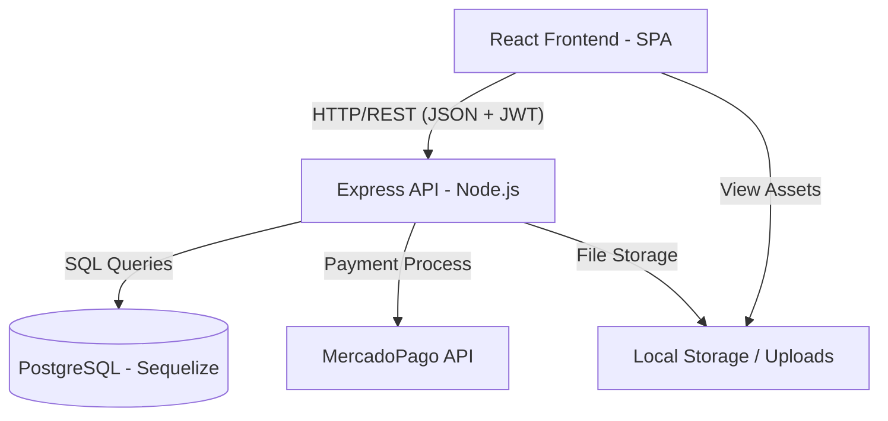
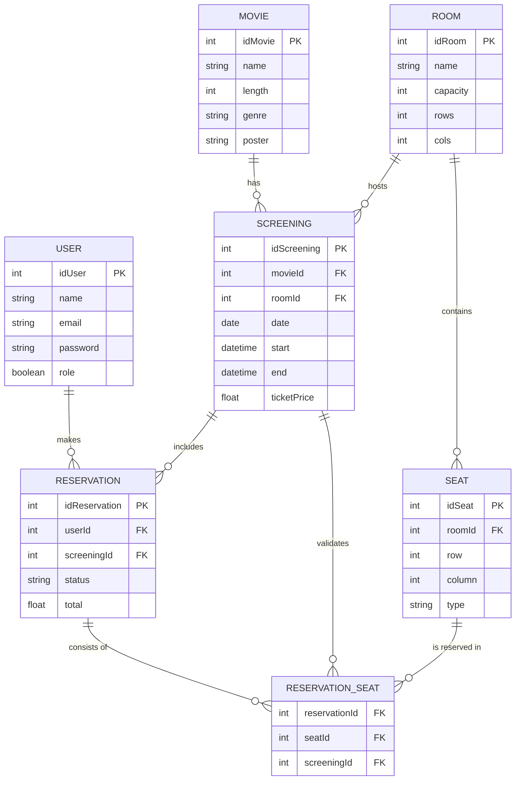

# Cinema Booking & Management System - Fullstack Application

## 1. Resumen Ejecutivo y Stack Tecnológico

### Descripción General

Este proyecto es una plataforma integral para la gestión de cines y reserva de entradas. Permite a los administradores gestionar el catálogo de películas, configurar salas y asientos, y programar funciones (screenings). Los usuarios finales pueden navegar por la cartelera, seleccionar funciones, elegir sus asientos en tiempo real a través de una interfaz interactiva y completar el proceso de compra con integración de pagos. El sistema garantiza la integridad de los datos mediante el uso de transacciones y bloqueos a nivel de base de datos para evitar la sobreventa de asientos.

### Tech Stack

Basado en el análisis de las dependencias, el sistema utiliza las siguientes tecnologías clave:

**Backend:**

- **Runtime:** Node.js con TypeScript.
- **Framework:** Express.js (v5.1.0).
- **ORM:** Sequelize con `sequelize-typescript` para un modelado de datos robusto y tipado.
- **Base de Datos:** PostgreSQL.
- **Autenticación:** JSON Web Tokens (JWT) y Bcryptjs para el hashing de contraseñas.
- **Pagos:** MercadoPago SDK.
- **Seguridad:** Helmet (Cabeceras HTTP seguras), express-rate-limit (Prevención DDOS/Fuerza Bruta) y CORS restrictivo.
- **Validación de Entorno:** Zod para tipado estricto y validación de variables en `.env`.
- **Middleware:** Multer para la gestión de subida de archivos (posters de películas y carrusel).
- **Testing:** Jest y Supertest.

**Frontend:**

- **Framework:** React (v19.2.0) con TypeScript.
- **Build Tool:** Vite.
- **Routing:** React Router DOM (v7.13.0).
- **Styling:** Bootstrap 5 y React-Bootstrap para una UI responsiva y profesional.
- **Animaciones:** Framer Motion.
- **Componentes UI:** Swiper (Carruseles), Lucide React (Iconografía).
- **Testing:** Vitest y React Testing Library con MSW (Mock Service Worker) para simular la API.

---

## 2. Instalación y Configuración Local

### Requisitos Previos

- **Node.js:** Versión 18 o superior.
- **PostgreSQL:** Base de datos instalada y en ejecución.
- **npm / yarn:** Gestor de paquetes.

### Paso 1: Clonar el repositorio

```bash
git clone https://github.com/FrancoJulianRossi/Trabajo-Final-Integrador.git
cd Trabajo-Final-Integrador
```

#### Crear la base de datos

```sql
create database cinema_db
```

### Paso 2: Configuración del Backend

1. Entrar al directorio del servidor:

```bash
   cd Backend
```

2. Instalar dependencias:

```bash
   npm install
```

3. Configurar variables de entorno:
   Edita el archivo `.env.example` a `.env` y asegúrate de configurar correctamente `FRONTEND_URL` y las variables de base de datos.
4. Ejecutar el comando build:

```bash
   npm run build
```

5. Ejecutar el servidor en modo desarrollo:

```bash
   npm run start
```

6. Ejecutar la peticion POST para poblar la base de datos:
   Postman
   `POST /seed`

### Paso 3: Configuración del Frontend

1. Entrar al directorio del cliente:
   ```bash
   cd ../Frontend
   ```
2. Instalar dependencias:
   ```bash
   npm install
   ```
3. Configurar variables de entorno:
   Edita el archivo `.env.example` a `.env` :
4. Ejecutar la aplicación:
   ```bash
   npm run dev
   ```

---

### Credenciales

#### Mercado pago

usuario: TESTUSER6565947047689893210

password: wGNiKqbGYv

codigo de verificacion: 235039

#### Login

ADMINISTRADOR

usuario: admin@example.com

password: admin

CLIENTE

usuario: client@example.com

password: client

## 3. Documentación de la API (Endpoints)

La API está prefijada con `/api`. Los endpoints protegidos requieren el header `Authorization: Bearer <token>`.

### Autenticación (`/auth`)

- `POST /auth/register`: Registro de nuevos usuarios.
- `POST /auth/login`: Inicio de sesión (Retorna JWT).

### Películas (`/movies`)

- `GET /movies`: Listar todas las películas.
- `GET /movies/:id`: Obtener detalles de una película.
- `POST /movies`: Crear película (Admin).
- `PUT /movies/:id`: Actualizar película (Admin).
- `DELETE /movies/:id`: Eliminar película (Admin).

### Salas y Funciones (`/rooms`, `/screenings`)

- `GET /rooms`: Listar todas las salas.
- `POST /rooms`: Crear sala (Admin).
- `GET /screenings`: Listar todas las funciones.
- `GET /screenings/:id`: Detalle de una función.
- `POST /screenings`: Programar nueva función (Admin).

### Reservas y Pagos (`/bookings`, `/payments`)

- `GET /bookings`: Listar reservas del usuario autenticado.
- `POST /bookings`: Crear una nueva reserva de asientos.
- `DELETE /bookings/:id`: Cancelar una reserva.
- `POST /payments/create-preference`: Integración con MercadoPago.
- `POST /payments/webhook`: Webhook para confirmación de pagos.

### Utilidades

- `POST /seed`: Población inicial de la base de datos con datos de prueba.

---

## 4. Arquitectura del Sistema

### Diagrama de Arquitectura

El sistema sigue una arquitectura cliente-servidor clásica con persistencia en una base de datos relacional y servicios externos de terceros.



### Flujo Breve (Brief Flow)

1. **Acción del Usuario:** El usuario selecciona una función y elige sus asientos en el Frontend.
2. **Petición a la API:** El cliente envía una petición `POST /api/bookings` incluyendo el token JWT y los datos de la reserva.
3. **Persistencia en DB:** El servidor valida la disponibilidad de los asientos dentro de una transacción de base de datos para asegurar la atomicidad.
4. **Respuesta:** La API confirma la reserva y el cliente redirige al usuario al flujo de pago o muestra un resumen del éxito de la operación.

---

## 5. Modelo de Dominio y Base de Datos

### Diagrama ER (Entidad-Relación)

El modelo de datos está diseñado para soportar la complejidad de las reservas de asientos por función específica.



---

## 6. Casos de Uso y Flujos Principales

### Casos de Uso

- **Actores (Usuarios):**
  - Consultar cartelera y detalles de películas.
  - Seleccionar asientos disponibles de forma interactiva.
  - Realizar reservas y gestionar historial de compras.
- **Actores (Administradores):**
  - Gestión de catálogo de películas (CRUD con subida de imágenes).
  - Configuración de salas y distribución de asientos.
  - Programación de funciones y gestión de precios.
  - Visualización y gestión de todas las reservas del sistema.

---

## 7. Análisis Técnico Destacado

### Fragmento de Código: Manejo de Transacciones y Bloqueos

Se ha seleccionado el método `createReservation` en `booking.services.ts` por su implementación de seguridad y consistencia de datos.

```typescript
// Backend/src/services/booking.services.ts (Simplificado)
async createReservation(screeningId: number, userId: number, seats: { row: number, column: number }[]) {
    const t = await sequelize.transaction();
    try {
        // ... búsqueda de asientos ...

        // Bloqueo de filas para prevenir inserciones concurrentes en los mismos asientos
        const occupied = await ReservationSeat.findAll({
            where: { seatId: seatInstances.map(s => s.idSeat) },
            include: [{
                model: Reservation,
                where: { screeningId, status: { [Op.or]: ["Pending", "Confirmed", "Paid"] } }
            }],
            transaction: t,
            lock: t.LOCK.UPDATE, // Bloqueo selectivo
        });

        if (occupied.length > 0) throw new Error("Some seats are already occupied");

        // ... creación de reserva y bulkCreate de asientos ...

        await t.commit();
        return reservation;
    } catch (error) {
        await t.rollback();
        throw error;
    }
}
```

**Explicación del Diseño:**
El uso de `t.LOCK.UPDATE` dentro de una transacción de Sequelize es vital en este dominio. Previene la condición de carrera donde dos usuarios intentan reservar el mismo asiento al mismo tiempo. Al bloquear las filas de `ReservationSeat` asociadas, el sistema garantiza que la validación de "Asientos Libres" sea atómica y segura para concurrencia masiva.

---

## 8. Interfaz y Ejemplos (Placeholders)

### UI Screenshots


_Vista de la cartelera y filtros de películas._


_Mapa interactivo de la sala permitiendo selección múltiple de asientos._


_Panel de administración para gestión de recursos._

### Ejemplo de JSON Payload (API Output)

Respuesta típica tras una reserva exitosa:

```json
{
  "idReservation": 125,
  "userId": 10,
  "screeningId": 45,
  "status": "Confirmed",
  "total": 4500.0,
  "reservationDate": "2026-03-03T15:30:00.000Z",
  "reservationSeats": [
    { "seatId": 501, "screeningId": 45 },
    { "seatId": 502, "screeningId": 45 }
  ]
}
```

---

## Integrantes

- #### Franco Julian Rossi
- #### Manuel Galdames
- #### Santiago Recari
- #### Martin Andres Garnica

---
